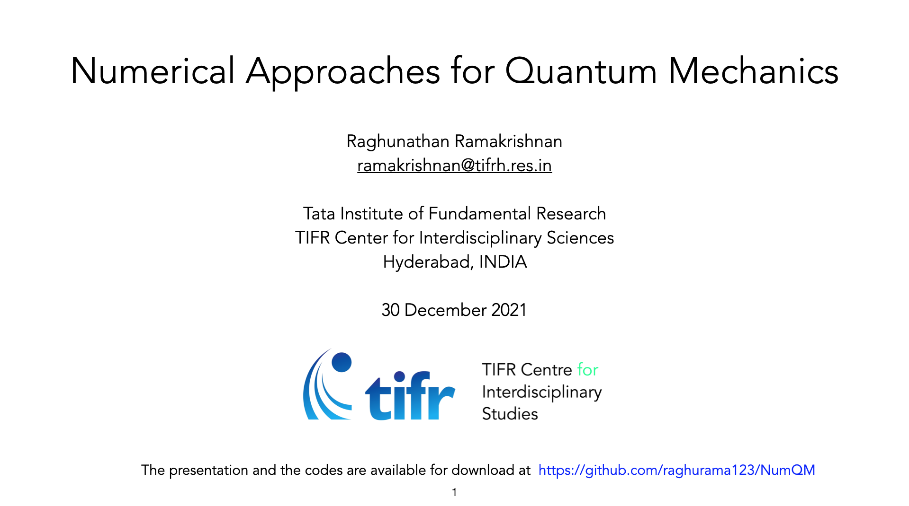

The best way to use this material is by forking it by click the Fork button at the top, right corner. Then you will get your own copy to play with!

The presentation and the notebooks are prepared for the lecture Numerical Approaches for Quantum Mechanics on 30 December 2021 as a part of the program
[National Initiative on Undergraduate Science (NIUS)](https://nius.hbcse.tifr.res.in/). NIUS is an initiative of the [Homi Bhabha Centre for Science Education, TIFR](https://www.hbcse.tifr.res.in/).

Click the slides below for the presentation 

You can access the Ipython notebooks interactively at [https://mybinder.org/v2/gh/raghurama123/NumQM_Basic/HEAD
](https://mybinder.org/v2/gh/raghurama123/NumQM_Basic/HEAD)
